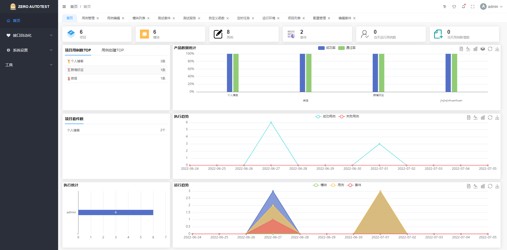
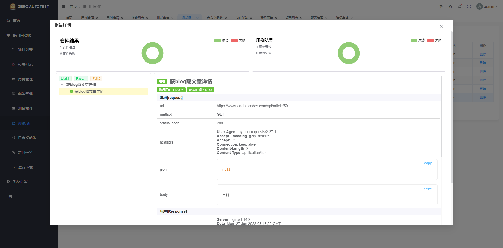
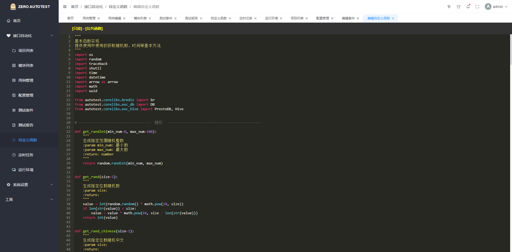

#### 🌈 介绍

#### 后端
- 基于 python + fastApi + celery + sqlalchemy + redis

- 使用软件版本
- python version 3.9.6
- mysql version 8.0.23
- redis version 6.0.9
- node version 18.15.0

#### 前端

- 基于 vite + vue3 + element-plus

- 使用软件版本
- node version 18.15.0
- vue  version 3.2.45
- element-plus  version 2.2.26


#### 💒 平台地址地址
- github 
https://github.com/baizunxian/zerorunner
- gitee
https://gitee.com/xb_xiaobai/zerorunner

#### ⛱️ 线上预览

- ZERO AUTOTEST
  自动化测试平台在线预览 <a href="https://xiaobaicodes.com" target="_blank">https://xiaobaicodes.com</a>

- 首页
  
- 报告页面
  
- 自定义函数
  

#### 🚧 项目启动初始化-后端

```bash
# 克隆项目
git clone https://github.com/baizunxian/zerorunner.git

# 数据库脚本 将内容复制数据库执行 需要新建数据库 zerorunner
backend/script/db_init.sql  

# 修改对应的数据库地址，redis 地址
backend/config.py
# 或者
backend/.env # 环境文件中的地址修改

# 安装依赖
pip install -r  requirements

# 运行项目 zerorunner/backend 目录下执行
python main.py

# 异步任务依赖 celery 启动命令

#  windows 启动，只能单线程 zerorunner/backend 目录下执行
celery -A celery_worker.worker.celery worker --pool=solo -l INFO 

# linux 启动
elery -A celery_worker.worker.celery worker --loglevel=INFO -c 10 -P solo -n zerorunner-celery-worker

# 定时任务启动
celery -A celery_worker.worker.celery beat -S celery_worker.scheduler.schedulers:DatabaseScheduler -l INFO

# 定时任务心跳启动
celery -A celery_worker.worker.celery beat  -l INFO 

```

#### 🚧 项目启动初始化-前端

```bash
# node 版本
node -v 
v18.15.0
```

- 复制代码(桌面 cmd 运行) `npm install -g cnpm --registry=https://registry.npm.taobao.org`
- 复制代码(桌面 cmd 运行) `npm install -g yarn`

```bash
# 克隆项目
git clone https://github.com/baizunxian/zerorunner.git

# 进入项目
cd zerorunner/frontend

# 安装依赖
cnpm install 
# 或者
yarn insatll

# 运行项目
cnpm run dev
# 或者 
yarn dev

# 打包发布
cnpm run build
# 或者 
yarn build
```

#### 💯 学习交流加 微信 群

- 或者添加我的微信，我可以拉你们进入交流群
  

#### 💌 支持作者

如果觉得框架不错，或者已经在使用了，希望你可以去 <a target="_blank" href="https://github.com/baizunxian/zerorunner">
Github</a> 帮我点个 ⭐ Star，这将是对我极大的鼓励与支持, 平台会持续迭代更新。
